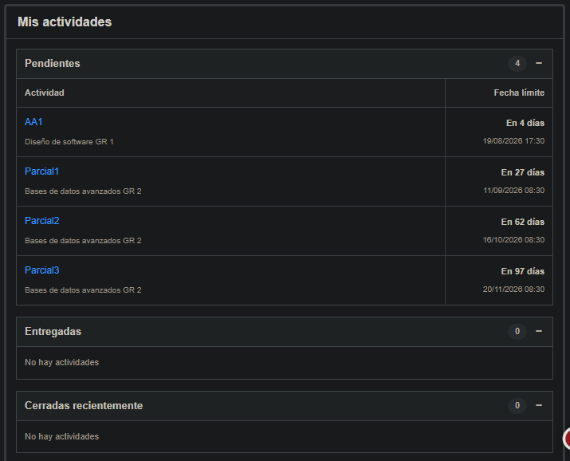

  

## TecPendientes
TecPendientes es una extensión para navegadores basada en Chromium que mejora la visualización de las actividades académicas en TecDigital.
La extensión agrega un panel de **"Mis actividades"** directamente en la página principal de TecDigital, permitiendo consultar rápidamente las actividades pendientes, entregadas y cerradas recientemente sin tener que ingresar individualmente al módulo de evaluaciones de cada curso.

## Enlaces de descarga
# Navegadores

| Google Chrome | Microsoft Edge | Mozilla Firefox |
| :---: | :---: | :---: |
|  |  |  |
| https://chromewebstore.google.com/detail/tecpendientes-inspector/nabnemlmbmfacecaecfeablipcldgnfa?utm_source=ext_app_menu | https://microsoftedge.microsoft.com/addons/detail/ljijiplmjogdmhkehhhdlobkfbkfgldk | https://addons.mozilla.org/es-ES/firefox/addon/tecpendientes-inspector/ |

## Características
- Detecta automáticamente los cursos actuales del estudiante.
- Consulta las actividades disponibles en cada curso.
- Ignora cursos en los que el usuario posee acceso administrativo.
- Organiza las actividades según su estado:
  - Pendientes.
  - Entregadas.
  - Cerradas recientemente.
- Ordena las actividades según su fecha límite.
- Muestra el tiempo restante para cada entrega.
- Ignora actividades que no tienen una fecha de entrega definida.
- Integra la información directamente en la página principal de TecDigital.
- Utiliza la sesión de TecDigital que ya se encuentra iniciada en el navegador.

## Vista general
Al ingresar a TecDigital, TecPendientes agrega un nuevo apartado debajo del panel de aplicaciones:

  

Mientras la información está siendo procesada, el panel muestra un indicador de carga.

## Privacidad
TecPendientes funciona utilizando la sesión de TecDigital que el usuario ya tiene iniciada en su navegador.
La extensión no solicita ni almacena directamente las credenciales del usuario.
La información académica necesaria para generar el panel de actividades es procesada localmente por la extensión en el navegador.
TecPendientes no envía esta información a servidores externos.
Para más información, consulte la política de privacidad del proyecto.

## Instalación para desarrollo
Para probar TecPendientes localmente:
1. Clone o descargue este repositorio.
2. Abra Google Chrome.
3. Ingrese a: `chrome://extensions`
5. Active **Modo de desarrollador**.
6. Seleccione **Cargar extensión sin empaquetar**.
7. Seleccione la carpeta del proyecto que contiene `manifest.json`.
8. Ingrese normalmente a TecDigital.
La extensión debería detectar la página principal y mostrar el panel **Mis actividades**.
Las consultas se realizan utilizando la sesión activa del usuario en TecDigital.

## Compatibilidad
TecPendientes está desarrollado como una extensión basada en **Manifest V3**.
Está pensado principalmente para navegadores compatibles con extensiones de Chromium, incluyendo:
- Google Chrome
- Microsoft Edge
- Otros navegadores basados en Chromium que permitan extensiones Manifest V3

## Estado del proyecto
TecPendientes se encuentra actualmente en desarrollo.
Algunas funcionalidades pueden cambiar conforme se realicen pruebas con diferentes cursos y configuraciones de TecDigital.

## Aviso
TecPendientes es un proyecto independiente y no es una extensión oficial del Instituto Tecnológico de Costa Rica ni de TecDigital.
Los nombres y marcas mencionados pertenecen a sus respectivos propietarios.

## Contribuciones
Las sugerencias, reportes de errores y contribuciones son bienvenidas.
Puede utilizar la sección de **Issues** del repositorio para reportar problemas o proponer mejoras.

## Licencia
Este proyecto se distribuye bajo una licencia de uso no comercial.

El código fuente puede ser utilizado, estudiado y modificado con fines personales, educativos y académicos. No se permite su uso comercial, venta o monetización sin autorización previa.

Consulte el archivo `LICENSE` para obtener más información.
